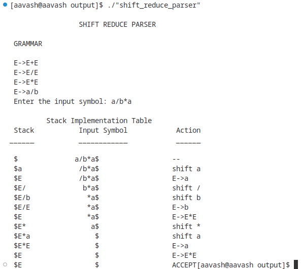

# Lab 1:

1. Write a program to check whether the input is digit or not.

## Code:

```cpp
%{
#include<stdio.h>
#include<stdlib.h>
%}

%%`

^[0-9]*                 printf("digit\n");
^[^0-9]|[0-9]*[a-zA-Z]  printf("not a digit\n");
. ;

%%

int main()
{
    // The function that starts the analysis
    yylex();
    return 0;
}
```

## Output:

{ width=400px }

\newpage

2. Write a program to identify tokens.

## Code:

```cpp
%{
#include<stdio.h>
%}

%%

bool|int|float                { printf("Keyword\n"); }
[-+]?([0-9]+(\.[0-9]+)?)      { printf("Constant\n"); }
[,.'"]+                       { printf("Punctuation Char\n"); }
[!@#$%^&*()]+                 { printf("Special Char\n"); }
[a-zA-Z][a-zA-Z0-9]*          { printf("Identifier\n"); }

%%

int main()
{
    yylex();
    return 0;
}

```

## Output:

{ width=400px }

\newpage

# Lab 2: Write a program to DFA that accept string.

1. string = 'baab'


## Code:

```cpp
#include <stdio.h>

int main() {
    char str[20], ch;
    int i = 0, state = 0;

    printf("Enter a string: ");
    scanf("%s", str);

    while (str[i] != '\0') {
        ch = str[i];
        i++;
        switch (state) {
            case 0:
                if (ch == 'b') {
                    state = 1;
                } else {
                    state = 5;
                }
                break;
            case 1:
                if (ch == 'a') {
                    state = 2;
                } else {
                    state = 5;
                }
                break;
            case 2:
                if (ch == 'a') {
                    state = 3;
                } else {
                    state = 5;
                }
                break;
            case 3:
                if (ch == 'b') {
                    state = 4;
                } else {
                    state = 5;
                }
                break;
            case 4:
                state = 5;
                break;
            case 5:
                break;
        }
    }

    if (state == 4) {
        printf("The string is accepted\n");
    } else {
        printf("The string is invalid\n");
    }

    return 0;
}
```

## Output:

{ width=400px }

\newpage

1. string = 'abba'

## Code:

```cpp
#include <stdio.h>

int main() {
    char str[20], ch;
    int i = 0, state = 0;

    printf("Enter a string: ");
    scanf("%s", str);

    while (str[i] != '\0') {
        ch = str[i];
        i++;
        switch (state) {
            case 0:
                if (ch == 'a') {
                    state = 1;
                } else {
                    state = 5;
                }
                break;
            case 1:
                if (ch == 'b') {
                    state = 2;
                } else {
                    state = 5;
                }
                break;
            case 2:
                if (ch == 'b') {
                    state = 3;
                } else {
                    state = 5;
                }
                break;
            case 3:
                if (ch == 'a') {
                    state = 4;
                } else {
                    state = 5;
                }
                break;
            case 4:
                state = 5;
                break;
            case 5:
                break;
        }
    }

    if (state == 4) {
        printf("The string is accepted\n");
    } else {
        printf("The string is invalid\n");
    }

    return 0;
}
```

## Output:

{ width=400px }

\newpage

# Lab 3:
1. Write a program to check valid identifier.

## Code:

```cpp
#include <stdio.h>
#include <ctype.h>

int main() {
    char a[10];
    int flag, i = 1;

    printf("Enter an identifier: ");
    scanf("%s", a);

    if (isalpha(a[0]) || a[0] == '_') {
        flag = 1;
    } else {
        flag = 0;
    }

    while (a[i] != '\0') {
        if (!isdigit(a[i]) && !isalpha(a[i]) && a[i] != '_') {
            flag = 0;
            break;
        }
        i++;
    }

    if (flag == 1) {
        printf("Valid identifier\n");
    } else {
        printf("Not a valid identifier\n");
    }

    return 0;
}
```

## Output:

{ width=400px }

\newpage


2. Write a program to check valid comment or not.

## Code:

```cpp
#include <stdio.h>

int main() {
    char com[100];
    int i = 2, a = 0;

    printf("Enter comment: ");
    scanf(" %[^\n]s", com);

    if (com[0] == '/') {
        if (com[1] == '/') {
            printf("It is a comment\n");
        } else if (com[1] == '*') {
            for (i = 2; com[i] != '\0'; i++) {
                if (com[i] == '*' && com[i + 1] == '/') {
                    printf("It is a comment\n");
                    a = 1;
                    break;
                }
            }
            if (a == 0) {
                printf("It is not a comment\n");
            }
        } else {
            printf("It is not a comment\n");
        }
    } else {
        printf("It is not a comment\n");
    }

    return 0;
}
```

## Output:

{ width=400px }

\newpage


# Lab 4: Write a program to count number of operators used in given input.

## Code:

```cpp
#include <stdio.h>

int count_operators(char *expression) {
    int count = 0;
    for (int i = 0; expression[i] != '\0'; i++) {
        if (expression[i] == '+' || expression[i] == '-' || 
            expression[i] == '*' || expression[i] == '/' ||
            expression[i] == '=' ) {
            count++;
        }
    }
    return count;
}

int main() {
    char expression[100];
    printf("Enter an expression: ");
    fgets(expression, 100, stdin);
    int count = count_operators(expression);
    printf("The number of operators in the expression is %d\n", count);
    return 0;
}
```

## Output:

{ width=400px }

\newpage


# Lab 5:

1. Write a program to find the first of given grammar.

```
S🡪L+R
S🡪R
L🡪*R
L🡪a
R🡪L
```

## Code:

```cpp
#include <stdio.h>
#include <ctype.h>

void FIRST(char[], char);
void addToResultSet(char[], char);
int numOfProductions;
char productionSet[10][10];

int main() {
    int i;
    char choice;
    char c;
    char result[20];
    
    printf("How many number of productions? : ");
    scanf(" %d", &numOfProductions);
    
    for (i = 0; i < numOfProductions; i++) { // Read production strings e.g.: E=E+T
        printf("Enter production Number %d: ", i + 1);
        scanf(" %s", productionSet[i]);
    }
    
    do {
        printf("\nFind the FIRST of: ");
        scanf(" %c", &c);
        
        FIRST(result, c); // Compute FIRST; Get answer in 'result' array
        
        printf("\nFIRST(%c) = { ", c);
        for (i = 0; result[i] != '\0'; i++) {
            printf(" %c ", result[i]); // Display result
        }
        printf("}\n");
        
        printf("Press 'y' to continue: ");
        scanf(" %c", &choice);
    } while (choice == 'y' || choice == 'Y');
    
    return 0;
}

void FIRST(char *Result, char c) {
    int i, j, k;
    char subResult[20];
    int foundEpsilon;
    subResult[0] = '\0';
    Result[0] = '\0';
    
    // If X is terminal, FIRST(X) = {X}
    if (!isupper(c)) {
        addToResultSet(Result, c);
        return;
    }
    
    // If X is non-terminal then read each production
    for (i = 0; i < numOfProductions; i++) {
        // Find production with X as LHS
        if (productionSet[i][0] == c) {
            if (productionSet[i][2] == '$') {
                addToResultSet(Result, '$');
            } else {
                j = 2;
                while (productionSet[i][j] != '\0') {
                    foundEpsilon = 0;
                    FIRST(subResult, productionSet[i][j]);
                    
                    for (k = 0; subResult[k] != '\0'; k++) {
                        addToResultSet(Result, subResult[k]);
                    }
                    
                    for (k = 0; subResult[k] != '\0'; k++) {
                        if (subResult[k] == '$') {
                            foundEpsilon = 1;
                            break;
                        }
                    }
                    
                    // No epsilon found, no need to check next element
                    if (!foundEpsilon) {
                        break;
                    }
                    j++;
                }
            }
        }
    }
    
    return;
}

void addToResultSet(char Result[], char val) {
    int k;
    for (k = 0; Result[k] != '\0'; k++) {
        if (Result[k] == val) {
            return;
        }
    }
    Result[k] = val;
    Result[k + 1] = '\0';
}
```

## Output:

{ width=400px }

\newpage

2. Write a program to find the follow of the given grammar.

```
R🡪aS
R🡪(R)S
S🡪+RS
S🡪aRS
S🡪aS
```

## Code:

```cpp
#include <stdio.h>
#include <string.h>
#include <ctype.h>

int n;
char productionSet[10][10];
char subResult[20];
char result[20];

void follow(char *result, char c);
void first(char *result, char c);
void addToResultSet(char result[], char val);

int main() {
    int i;
    char choice;
    char c;
    
    printf("Enter the number of productions: ");
    scanf("%d", &n);
    
    printf("Enter %d productions\nProductions with multiple terms should be given as separate productions\n", n);
    for (i = 0; i < n; i++) {
        scanf("%s", productionSet[i]);
    }
    
    do {
        printf("Find FOLLOW of: ");
        scanf(" %c", &c);
        follow(result, c);
        
        printf("FOLLOW(%c) = { ", c);
        for (i = 0; result[i] != '\0'; i++) {
            printf("%c ", result[i]);
        }
        printf("}\n");
        
        printf("Press 'y' to continue: ");
        scanf(" %c", &choice);
    } while (choice == 'y' || choice == 'Y');
    
    return 0;
}

void follow(char *result, char c) {
    int i, j, k;
    subResult[0] = '\0';
    result[0] = '\0';
    
    if (productionSet[0][0] == c) {
        addToResultSet(result, '$');
    }
    
    for (i = 0; i < n; i++) {
        for (j = 2; j < strlen(productionSet[i]); j++) {
            if (productionSet[i][j] == c) {
                if (productionSet[i][j + 1] != '\0') {
                    first(subResult, productionSet[i][j + 1]);
                }
                if (productionSet[i][j + 1] == '\0' && c != productionSet[i][0]) {
                    follow(subResult, productionSet[i][0]);
                }
                for (k = 0; subResult[k] != '\0'; k++) {
                    addToResultSet(result, subResult[k]);
                }
            }
        }
    }
}

void first(char *result, char c) {
    int i;
    if (!(isupper(c))) {
        addToResultSet(result, c);
        return;
    }
    
    for (i = 0; i < n; i++) {
        if (productionSet[i][0] == c) {
            if (productionSet[i][2] == '#') {
                follow(result, productionSet[i][0]);
            } else if (!isupper(productionSet[i][2])) {
                addToResultSet(result, productionSet[i][2]);
            } else {
                first(result, productionSet[i][2]);
            }
        }
    }
}

void addToResultSet(char result[], char val) {
    int k;
    for (k = 0; result[k] != '\0'; k++) {
        if (result[k] == val) {
            return;
        }
    }
    result[k] = val;
    result[k + 1] = '\0';
}
```

## Output:

{ width=400px }

\newpage


# Lab 6: Write a program for constructing of LL (1) Parsing.

## Code:

```cpp
#include <stdio.h>
#include <string.h>
#include <stdlib.h>

char s[20], stack[20];

int main() {
    // Parsing table for the given grammar
    // e -> tb, t -> fc, b -> +tb | epsilon, c -> *fc | epsilon, f -> i | (e)
    char m[5][6][4] = {
        {"tb", "",   "",   "tb", "", ""},     // e
        {"", "+tb", "",   "",   "n", "n"},    // b
        {"fc", "",   "",   "fc", "", ""},     // t
        {"", "n",   "*fc", "",   "n", "n"},   // c
        {"i", "",   "",   "(e)", "", ""}      // f
    };
    
    int size[5][6] = {
        {2, 0, 0, 2, 0, 0},
        {0, 3, 0, 0, 1, 1},
        {2, 0, 0, 2, 0, 0},
        {0, 1, 3, 0, 1, 1},
        {1, 0, 0, 3, 0, 0}
    };
    
    int i, j, k, n, str1, str2;
    
    printf("\nEnter the input string: ");
    scanf("%s", s);
    
    strcat(s, "$");
    n = strlen(s);
    
    stack[0] = '$';
    stack[1] = 'e';
    
    i = 1;
    j = 0;
    
    printf("\nStack\tInput\n");
    printf("__________________\n");
    
    while ((stack[i] != '$') && (s[j] != '$')) {
        if (stack[i] == s[j]) {
            i--;
            j++;
        }
        
        switch (stack[i]) {
            case 'e':
                str1 = 0;
                break;
            case 'b':
                str1 = 1;
                break;
            case 't':
                str1 = 2;
                break;
            case 'c':
                str1 = 3;
                break;
            case 'f':
                str1 = 4;
                break;
        }
        
        switch (s[j]) {
            case 'i':
                str2 = 0;
                break;
            case '+':
                str2 = 1;
                break;
            case '*':
                str2 = 2;
                break;
            case '(':
                str2 = 3;
                break;
            case ')':
                str2 = 4;
                break;
            case '$':
                str2 = 5;
                break;
        }
        
        if (m[str1][str2][0] == '\0') {
            printf("\nERROR\n");
            exit(0);
        } else if (m[str1][str2][0] == 'n') {
            i--;
        } else if (m[str1][str2][0] == 'i') {
            stack[i] = 'i';
        } else {
            for (k = size[str1][str2] - 1; k >= 0; k--) {
                stack[i] = m[str1][str2][k];
                i++;
            }
            i--;
        }
        
        for (k = 0; k <= i; k++) {
            printf("%c", stack[k]);
        }
        printf("\t\t");
        
        for (k = j; k < n; k++) {
            printf("%c", s[k]);
        }
        printf("\n");
    }
    
    if (stack[i] == 'b' && s[j] == '$') {
        printf("\nSUCCESS\n");
    } else {
        printf("\nERROR\n");
    }
    
    return 0;
}
```

## Output:

{ width=400px }

\newpage


# Lab 7: Write a program to implement Shift Reduce Parsing.

```
E🡪E+E
E🡪E/E
E🡪E*E
E🡪a/b

Input symbol a/b*a
```

## Code:

```cpp
#include <stdio.h>
#include <stdlib.h>
#include <string.h>

char ip_sym[15], stack[15];
int ip_ptr = 0, st_ptr = 0, len, i;
char temp[2], temp2[2];
char act[15];

void check();

int main()
{
    printf("\n\t\t SHIFT REDUCE PARSER\n");
    printf("\n GRAMMAR\n");
    printf("\n E->E+E\n E->E/E");
    printf("\n E->E*E\n E->a/b");
    printf("\n Enter the input symbol: ");
    scanf("%s", ip_sym);

    printf("\n\t Stack Implementation Table");
    printf("\n Stack\t\t Input Symbol\t\t Action");
    printf("\n______\t\t ____________\t\t ______\n");
    printf("\n $\t\t%s$\t\t\t--", ip_sym);

    strcpy(act, "shift ");
    temp[0] = ip_sym[ip_ptr];
    temp[1] = '\0';
    strcat(act, temp);

    len = strlen(ip_sym);

    for (i = 0; i <= len - 1; i++)
    {
        stack[st_ptr] = ip_sym[ip_ptr];
        stack[st_ptr + 1] = '\0';
        ip_sym[ip_ptr] = ' ';
        ip_ptr++;
        printf("\n $%s\t\t%s$\t\t\t%s", stack, ip_sym, act);
        strcpy(act, "shift ");
        temp[0] = ip_sym[ip_ptr];
        temp[1] = '\0';
        strcat(act, temp);
        check();
        st_ptr++;
    }
    st_ptr++;
    check();

    return 0;
}

void check()
{
    int flag = 0;
    temp2[0] = stack[st_ptr];
    temp2[1] = '\0';

    if ((!strcmp(temp2, "a")) || (!strcmp(temp2, "b")))
    {
        stack[st_ptr] = 'E';
        if (!strcmp(temp2, "a"))
            printf("\n $%s\t\t%s$\t\t\tE->a", stack, ip_sym);
        else
            printf("\n $%s\t\t%s$\t\t\tE->b", stack, ip_sym);
        flag = 1;
    }

    if ((!strcmp(temp2, "+")) || (!strcmp(temp2, "*")) || (!strcmp(temp2, "/")))
    {
        flag = 1;
    }

    if ((!strcmp(stack, "E+E")) || (!strcmp(stack, "E/E")) || (!strcmp(stack, "E*E")))
    {
        strcpy(stack, "E");
        st_ptr = 0;
        if (!strcmp(stack, "E+E"))
            printf("\n $%s\t\t%s$\t\t\tE->E+E", stack, ip_sym);
        else if (!strcmp(stack, "E/E"))
            printf("\n $%s\t\t%s$\t\t\tE->E/E", stack, ip_sym);
        else
            printf("\n $%s\t\t%s$\t\t\tE->E*E", stack, ip_sym);
        flag = 1;
    }

    if (!strcmp(stack, "E") && ip_ptr == len)
    {
        printf("\n $%s\t\t%s$\t\t\tACCEPT", stack, ip_sym);
        exit(0);
    }

    if (flag == 0)
    {
        printf("\n%s\t\t\t%s\t\t reject", stack, ip_sym);
        exit(0);
    }
}
```

## Output:

{ width=400px }

\newpage


# Lab 8: Write a program to implement intermediate code generation.

```
X=a+b-c*d/e
```

## Code:

```cpp
#include <stdio.h>
#include <string.h>
#include <stdlib.h>
int i = 1, j = 0, no = 0, tmpch = 90;
char str[100], left[15], right[15];
void findopr();
void explore();
void fleft(int);
void fright(int);
struct exp
{
    int pos;
    char op;
} k[15];
int main()
{
    printf("\t\t INTERMEDIATE CODE GENERATION\n\n");
    printf("Enter the Expression :");
    scanf("%s", str);
    printf("The intermediate code:\t\t Expression\n");
    findopr();
    explore();
    return 0;
}
void findopr()
{
    for (i = 0; str[i] != '\0'; i++)
        if (str[i] == ':')
        {
            k[j].pos = i;
            k[j++].op = ':';
        }
    for (i = 0; str[i] != '\0'; i++)
        if (str[i] == '/')
        {
            k[j].pos = i;
            k[j++].op = '/';
        }
    for (i = 0; str[i] != '\0'; i++)
        if (str[i] == '*')
        {
            k[j].pos = i;
            k[j++].op = '*';
        }
    for (i = 0; str[i] != '\0'; i++)
        if (str[i] == '+')
        {
            k[j].pos = i;
            k[j++].op = '+';
        }
    for (i = 0; str[i] != '\0'; i++)
    {
        if (str[i] == '-')
        {
            k[j].pos = i;
            k[j++].op = '-';
        }
    }
}
void explore()
{
    i = 1;
    while (k[i].op != '\0')
    {
        fleft(k[i].pos);
        fright(k[i].pos);
        str[k[i].pos] = tmpch--;
        printf("\t%c := %s%c%s\t\t", str[k[i].pos], left, k[i].op, right);
        for (j = 0; j < strlen(str); j++)
            if (str[j] != '$')
                printf("%c", str[j]);
        printf("\n");
        i++;
    }
    fright(-1);
    if (no == 0)
    {
        fleft(strlen(str));
        printf("\t%s := %s", right, left);
        exit(0);
    }
    printf("\t%s := %c", right, str[k[--i].pos]);
}
void fleft(int x)
{
    int w = 0, flag = 0;
    x--;
    while (x != -1 && str[x] != '+' && str[x] != '*' && str[x] != '=' && str[x] != '\0' && str[x] != '-' && str[x] != '/' && str[x] != ':')
    {
        if (str[x] != '$' && flag == 0)
        {
            left[w++] = str[x];
            left[w] = '\0';
            str[x] = '$';
            flag = 1;
        }
        x--;
    }
}
void fright(int x)
{
    int w = 0, flag = 0;
    x++;
    while (x != -1 && str[x] != '+' && str[x] != '*' && str[x] != '\0' && str[x] != '=' && str[x] != ':' && str[x] != '-' && str[x] != '/')
    {
        if (str[x] != '$' && flag == 0)
        {
            right[w++] = str[x];
            right[w] = '\0';
            str[x] = '$';
            flag = 1;
        }
        x++;
    }
}
```

## Output:

{ width=400px }

\newpage


# Lab 9: Write a program to implement machine code generation.

## Code:

```cpp
#include <stdio.h>
#include <string.h>

void generateMachineCode(const char* inputFile, const char* outputFile);

int main() {
    generateMachineCode("input.txt", "output.txt");
    return 0;
}

void generateMachineCode(const char* inputFile, const char* outputFile) {
    FILE *input, *output;
    char op[2], arg1[5], arg2[5], result[5];

    // Open input file for reading
    input = fopen(inputFile, "r");
    if (input == NULL) {
        perror("Error opening input file");
        return;
    }

    // Open output file for writing machine code
    output = fopen(outputFile, "w");
    if (output == NULL) {
        perror("Error opening output file");
        fclose(input);
        return;
    }

    // Read operations and operands from input file until end-of-file
    while (fscanf(input, "%s%s%s%s", op, arg1, arg2, result) == 4) {
        if (strcmp(op, "+") == 0) {
            fprintf(output, "\n MOV R0,%s", arg1);
            fprintf(output, "\n ADD R0,%s", arg2);
            fprintf(output, "\n MOV %s,R0", result);
        }
        else if (strcmp(op, "*") == 0) {
            fprintf(output, "\n MOV R0,%s", arg1);
            fprintf(output, "\n MUL R0,%s", arg2);
            fprintf(output, "\n MOV %s,R0", result);
        }
        else if (strcmp(op, "-") == 0) {
            fprintf(output, "\n MOV R0,%s", arg1);
            fprintf(output, "\n SUB R0,%s", arg2);
            fprintf(output, "\n MOV %s,R0", result);
        }
        else if (strcmp(op, "/") == 0) {
            fprintf(output, "\n MOV R0,%s", arg1);
            fprintf(output, "\n DIV R0,%s", arg2);
            fprintf(output, "\n MOV %s,R0", result);
        }
        else if (strcmp(op, "=") == 0) {
            fprintf(output, "\n MOV R0,%s", arg1);
            fprintf(output, "\n MOV %s,R0", result);
        }
        else {
            fprintf(stderr, "Invalid operation: %s\n", op);
            continue;
        }
    }

    // Close files
    fclose(input);
    fclose(output);
}
```

## Output:

{ width=400px }